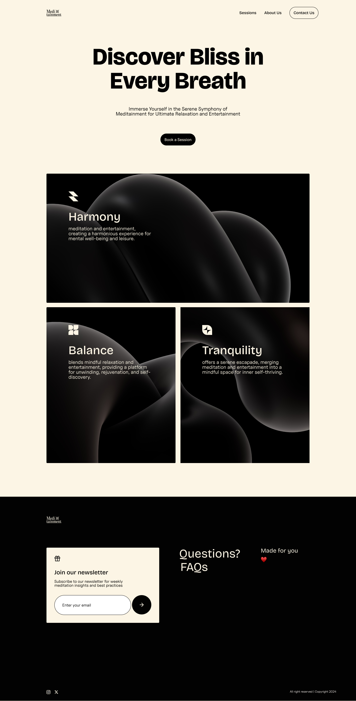

# Meditainment

A landing page for a fictitious wellness company that combines meditation with entertainment.

#### Things I was able to achieve on this project

- Setting up local fonts and extending Tailwind theme with font variables
- Setting up a sleek and beautiful notification library
- Highly responsive UI with best performance on all widely used views
- Using a component with `children` prop
- Use of many icons
- Optimized images for best performance
- Using `clsx` for constructing `className` conditionally

## Table of contents

- [Overview](#overview)
  - [The challenge](#the-challenge)
  - [Screenshot](#screenshot)
  - [Links](#links)
- [My process](#my-process)
  - [Built with](#built-with)
  - [Continued development](#continued-development)
- [Author](#author)
- [Acknowledgments](#acknowledgments)

## Overview

### The challenge

The challenge was to:

- Build a very well designed and high quality UI with highly optimized images and fast loading time of less than 1 second
- Build a high conversion UI
- Build a highly responsive UI that seamlessly adapts to all screen sizes
- Create button and input interactions that mimics email subscription
- Create a responsive and well designed navigation bar with animations.

### Screenshot

### Links

- [Solution URL](https://github.com/josephakayesi/meditainment/)
- [Live Site URL](https://meditainment.vercel.app/)

## My process

### Built with

- [NextJS](https://nextjs.org/)
- [Notistack](https://notistack.com/)
- [clsx](https://www.npmjs.com/package/clsx)
- [Tailwind](https://tailwindcss.com/)

### Continued development

- I want to focus more on creating high conversion landing pages with a high quality copy for marketing and converting leads.
- I want to focus on creating more delightful animations
- I want create high-performing and delightful data-intensive web applications

## Author

- Website - [Joseph Akayesi](https://www.josephakayesi.com)
- Linkedin - [josephakayesi](https://www.linkedin.com/in/josephakayesi/)
- Twitter - [@josephakayesi](https://www.twitter.com/josepakayesi)

## Acknowledgements

I drew inspiration from [Mono's website](https://mono.co/). There is a section on their website that implements a grid and I loved how it was executed on their site.
